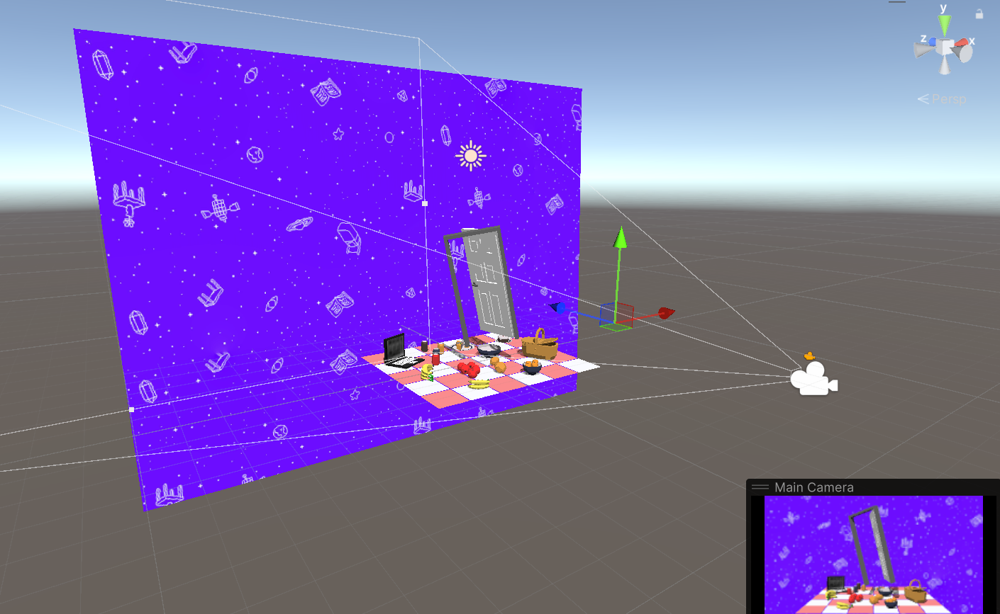
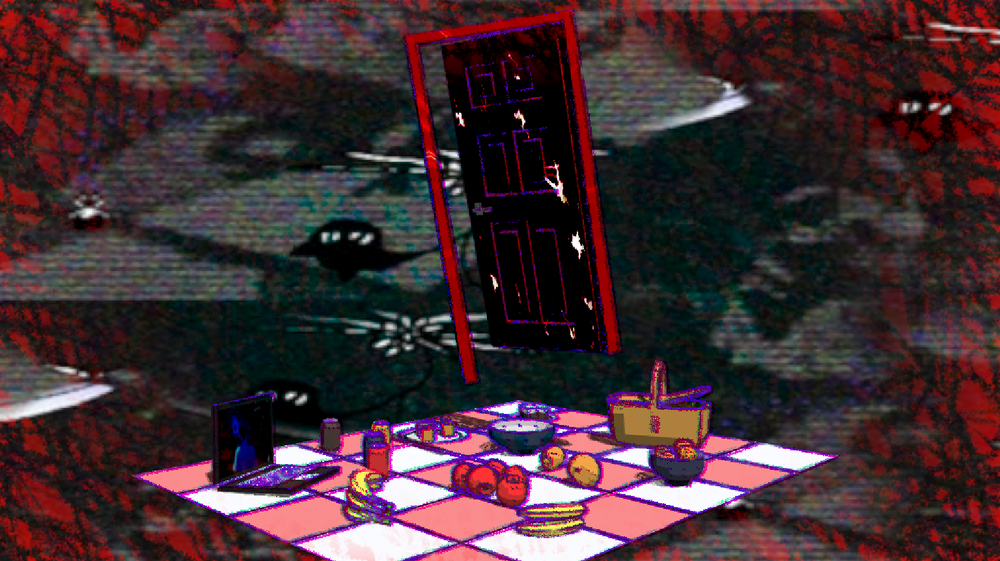

# HW 4: *3D Stylization* Submission (Charles Wang)

https://github.com/user-attachments/assets/8d6bde28-e8db-40dd-a7e4-8b54ad72e73a

## 1. Concept art

All three pieces are by [OMOCAT](https://x.com/_omocat) and her team!

| Piece 1 | Piece 2 | Piece 3 |
|-------|------|-------|
||||

I wanted to recreate the art style of OMORI, a game that is unique for its colored pencil look and animated outlines/sprites the characters, world, and environment.

## 2. Interesting Shaders

I added multiple light support by following the tutorial.

### Specular highlight

I didn't like how the specular highlight looked in my scene so I don't use it in the final setup, but here I show the implementation working (and it's available as a separate Shader Graph called "ToonWithSpecular" in the Shaders folder).

https://github.com/user-attachments/assets/e8e63a89-4431-4245-ad82-92d30d25df51

### Interesting shadow

To emulate the scribble-y look of OMORI, I used the pencil brush from Procreate to create this 512x512 texture, and tiled it using the website:

Later on I also create a "lighter" version of the texture when I want the lines to be less sparse.

### Special surface shader

To create the "selected" shader, I drew inspiration from two sources in the game. The first is how sometimes the art likes to invert colors. See [this YouTube video](https://www.youtube.com/watch?v=dU_Wbl5va3E) and look at the bottom left corner, OMORI flips colors. Also this picture:

I also wished to animate the selected object using the drawn look as seen in the game, which I did by reusing the shadow texture and overlaying it on the object. I used time, a triangle wave, and floored it so I could get staggered values to use to rotate the UV coords, allowing me to "animate" it. Here's a pic of the Graphtoy I used to plan it:

For this shader, I also went back to the shadow and made it animated in the same manner, using a different offset/time scale so it looks different from the actual object.

## 3. Outlines

I first implemented basic outlines using the Roberts Cross method.

However, outlines in OMORI art seem to be made up of three parts: a green, pink, and purple piece all overlayed on each other.

So I do just that in my shader, blending between them using Darken. In addition, each of the three outlines are customized by slightly offsetting the UVs to give a more "chromatic aberration" look, and I use the Random Range node to vary the thickness of the outlines depending on screen position. Finally, I use the same animation technique that I used in the surface shader above. Final result:

## 4. Full Screen Post Process Effect

Inspired by the white border that surrounds the first concept art piece, I decided to implement a white-colored vignette that goes around the screen borders. (I use the vignette "value" later on for interactivity. More deets below.)

## 5. Create a Scene

Models and credits:

- "Picnic Basket from Poly by Google" (https://skfb.ly/6XXuR) by IronEqual is licensed under Creative Commons Attribution (http://creativecommons.org/licenses/by/4.0/).
- "Low Poly Laptop" (https://skfb.ly/o9G6r) by zgoosr is licensed under Creative Commons Attribution (http://creativecommons.org/licenses/by/4.0/).
- "Low Poly Picnic Asset Pack" (https://skfb.ly/6TtZR) by lizhiqiang is licensed under Creative Commons Attribution (http://creativecommons.org/licenses/by/4.0/).
- "Door" (https://skfb.ly/opVZ9) by Arnau Rocher Alcayde is licensed under Creative Commons Attribution (http://creativecommons.org/licenses/by/4.0/).

For the laptop, I created a custom shader that specifically draws a texture to the screen geometry. To prevent the door from self-shadowing (and looking uglier), I added a `UseShadow` parameter that completely turns off shadow attenuation in the main toon shader. (We're not exactly being realistic in this HW.)

### Moving background

I wanted to include a background from the game as my scene's background. As a hack, I positioned a plane as a child of the main camera and created a shader that translated over the UVs of the background image as a texture, which is sampled using the UVs. This is then the final fragment output. I use this shader in a material that I put on the plane. Now the plane rotates along with the camera, so it looks like a background overlay!

## 6. Interactivity

Press Space to toggle between horror and back.

A number of changes occur when horror mode is turned on:

- The background translates faster and the opposite way. The image also changes to something else. I did this by including both as textures in the shader and picking between them based on the material parameter input.
- Similarly, the turntable camera rotates faster and the opposite way.
- The vignette gets replaced. Instead, I use the scribble texture from above as an interpolation value between a pure red color and the scene color. This gives it the "veiny" look. I also randomly offset the texture UV with time.
- I change the door's material to a modified version of the selected surface shader from earlier. In particular, shadows are removed and colors are adjusted to red and black. The phasing speed is also sped up.
- Laptop screen is replaced with another image. Same method as the background: simple logic switch in the laptop screen shader.
