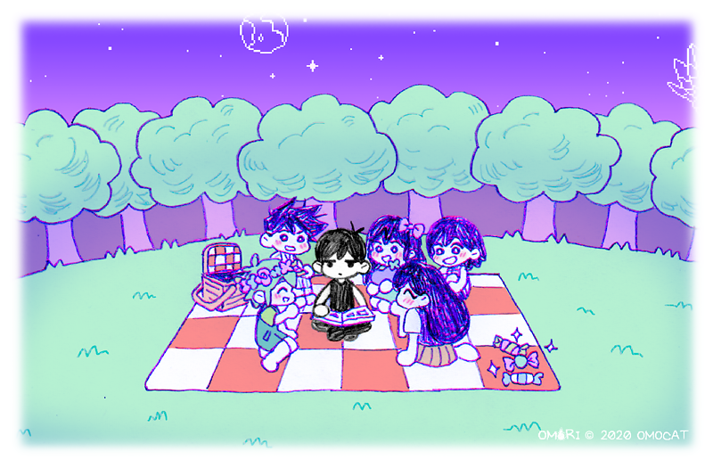
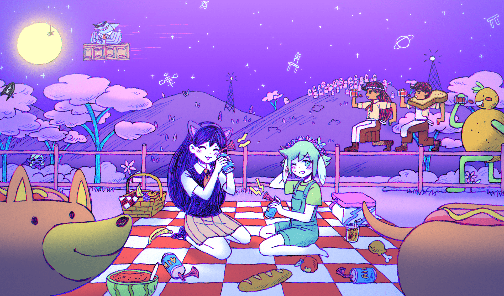
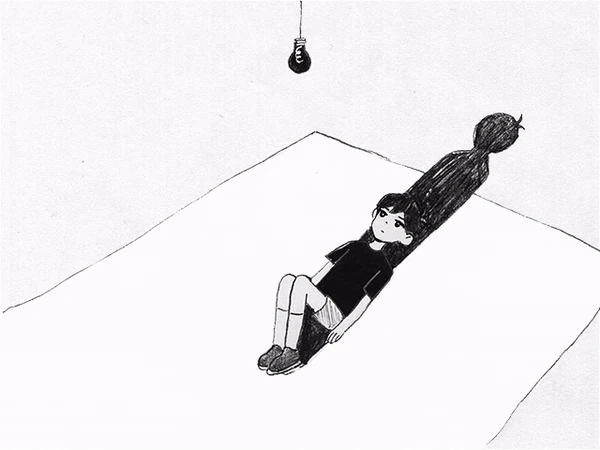
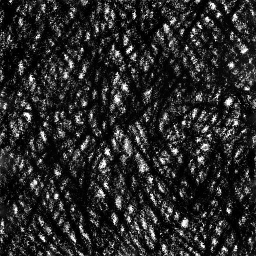
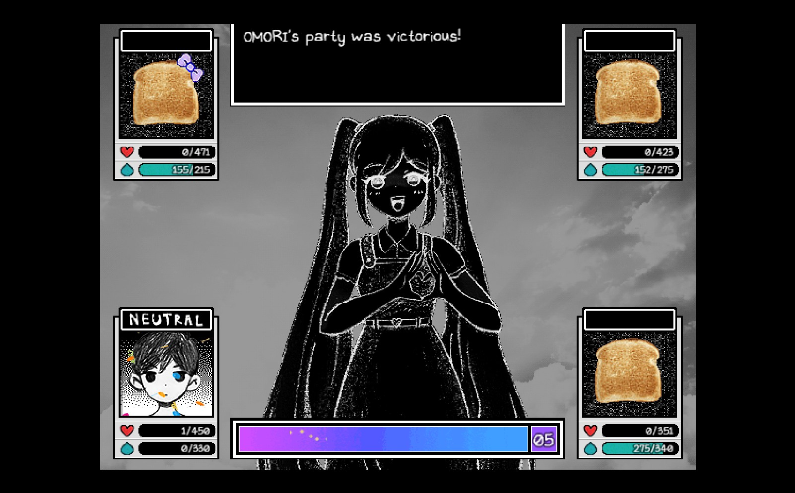
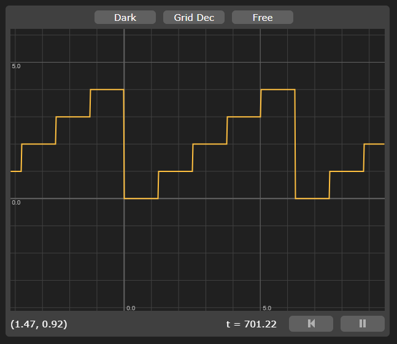
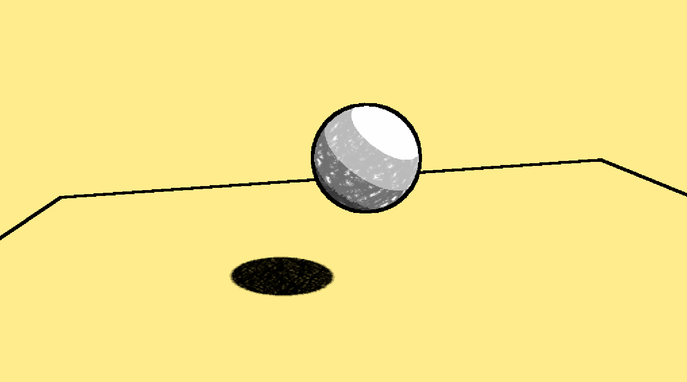
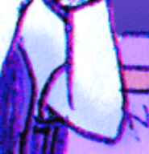
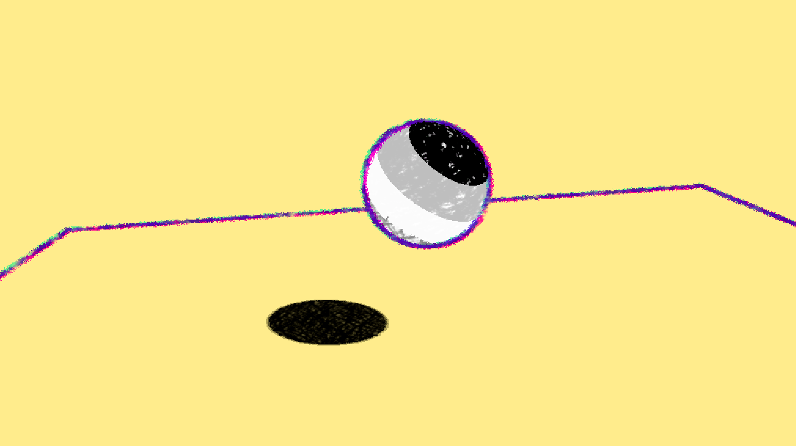

# HW 4: *3D Stylization* Submission (Charles Wang)

## 1. Concept art

All three pieces are by [OMOCAT](https://x.com/_omocat) and her team!

| Piece 1 | Piece 2 | Piece 3 |
|-------|------|-------|
||||

These static images don't do the art style justice. Apart from the colored pencil look, I specifically want to recreate the art style for OMORI, which is known to have animated outlines around its characters.

## 2. Interesting Shaders

I added multiple light support by following the tutorial.

### Specular highlight

I didn't like how the specular highlight looked in my scene so I don't use it in the final setup, but here I show the implementation working (and it's available as a separate Shader Graph called "ToonWithSpecular" in the Shaders folder).

https://github.com/user-attachments/assets/e8e63a89-4431-4245-ad82-92d30d25df51

### Interesting shadow

To emulate the scribble-y look of OMORI, I used the pencil brush from Procreate to create this 512x512 texture, and tiled it using the website:



### Special surface shader

To create the "selected" shader, I drew inspiration from two sources in the game. The first is how sometimes the art likes to invert colors. See [this YouTube video](https://www.youtube.com/watch?v=dU_Wbl5va3E) and look at the bottom left corner, OMORI flips colors. Also this picture:



I also wished to animate the selected object using the drawn look as seen in the game, which I did by reusing the shadow texture and overlaying it on the object. I used time, a triangle wave, and floored it so I could get staggered values to use to rotate the UV coords, allowing me to "animate" it. Here's a pic of the Graphtoy I used to plan it:



For this shader, I also went back to the shadow and made it animated in the same manner, using a different offset/time scale so it looks different from the actual object.

## 3. Outlines

I first implemented basic outlines using the Roberts Cross method.



However, outlines in OMORI art seem to be made up of three parts: a green, pink, and purple piece all overlayed on each other.



So I do just that in my shader, blending between them using Darken. In addition, each of the three outlines are customized by slightly offsetting the UVs to give a more "chromatic aberration" look, and I use the Random Range node to vary the thickness of the outlines depending on screen position. Finally, I use the same animation technique that I used in the surface shader above. Final result:



---
## 4. Full Screen Post Process Effect
We're nearing the end! 

### To-Do:
Ok, now regardless of what your concept art looks like, using what you know about toolbox functions and screen space effects, add an appealing post-process effect to give your scene a unique look. Your post processing effect should do at least one of the following.
* A vingette that darkens the edges of your images with a color or pattern
* Color / tone mapping that changes the colorization of your renders. [Here's some basic ideas, but please experiment](https://gmshaders.com/tutorials/basic_colors/) 
* A texture to make your image look like it's drawn on paper or some other surface.
* A blur to make your image look smudged.
* Fog or clouds that drift over your scene
* Whatever else you can think of that complements your scene!

***Note: This should be easily accomplishable using what you should have already learnt about working with Unity's Custom Render Features from the Outline section!***

---
## 5. Create a Scene
Using Unity's controls, create a ***SUPER BASIC*** scene with a few elements to show off your unique rendering stylization. Be sure to apply the materials you've created. Please don't go crazy with the geometry -- then you'll have github problems if your files are too large. [See here](https://docs.github.com/en/repositories/working-with-files/managing-large-files/about-large-files-on-github). 

Note that your modelling will NOT be graded at all for this assignment. It is **NOT** expected that your scene will be a one-to-one faithful replica of your concept art. You are **STRONGLY ENCOURAGED** to find free assets online, even if they don't strongly resemble the geometry/objects present in your concept art. (TLDR; If you choose to model your own geometry for this project, be aware of the time-constraint and risk!)

Some example resources for finding 3D assets to populate your scene With:
1. [SketchFab](https://sketchfab.com/)
2. [Mixamo](https://www.mixamo.com/#/)
3. [TurboSquid](https://www.turbosquid.com/)

## 6. Interactivity
As a finishing touch, let's show off the fact that our scene is rendered in real-time! Please add an element of interactivity to your scene. Change some major visual aspect of your scene on a keypress. The triggered change could be
* Party mode (things speed up, different colorization)
* Memory mode (different post-processing effects to color you scene differently)
* Fanart mode (different surface shaders, as if done by a different artist)
* Whatever else you can think of! Combine these ideas, or come up with something new. Just note, your interactive change should be at least as complex as implementing a new type of post processing effect or surface shader. We'll be disappointed if its just a parameter change. There should be significant visual change.

### To-Do:
* Create at least one new material to be swapped in using a key press
* Create and attach a new C# script that listens for a key press and swaps out the material on that key press. 
Your C# script should look something like this:
```
public Material[] materials;
private MeshRenderer meshRenderer;
int index;

void Start () {
          meshRenderer = GetComponent<MeshRenderer>();
}

void Update () {
          if (Input.GetKeyDown(KeyCode.Space)){
                 index = (index + 1) % materials.Count;
                 SwapToNextMaterial(index);
          }
}

void SwapToNextMaterial (int index) {
          meshRenderer.material = materials[index % materials.Count];
}
```
* Attach the c# script as a component to the object(s) that you want to change on keypress
* Assign all the relevant materials to the Materials list field so you object knows what to swap between.
 
---
## 7. Extra Credit
Explore! What else can you do to polish your scene?
  
- Implement Texture Support for your Toon Surface Shader with Appealing Procedural Coloring.
    - I.e. The procedural coloring needs to be more than just multiplying by 0.6 or 1.5 to decrease/increase the value. Consider more deeply the relationship between things such as value and saturation in artist-crafted color palettes? 
- Add an interesting terrain with grass and/or other interesting features
- Implement a Custom Skybox alongside a day-night cycle lighting script that changes the main directional light's colors and direction over time.
- Add water puddles with screenspace reflections!
- Any other similar level of extra spice to your scene : ) (Evaluated on a case-by-case basis by TAs/Rachel/Adam)

## Submission
1. Video of a turnaround of your scene
2. A comprehensive readme doc that outlines all of the different components you accomplished throughout the homework. 
3. All your source files, submitted as a PR against this repository.

## Resources:

1. Link to all my videos:
    - [Playlist link](https://www.youtube.com/playlist?list=PLEScZZttnDck7Mm_mnlHmLMfR3Q83xIGp)
2. [Lab Video](https://youtu.be/jc5MLgzJong?si=JycYxROACJk8KpM4)
3. Very Helpful Creators/Videos from the internet
    - [Cyanilux](https://www.cyanilux.com/)
        - [Article on Depth in Unity | How depth buffers work!](https://www.cyanilux.com/tutorials/depth/) 
    - [NedMakesGames](https://www.youtube.com/@NedMakesGames)
        - [Toon Shader Lighting Tutorial](https://www.youtube.com/watch?v=GQyCPaThQnA&ab_channel=NedMakesGames)
        - [Tutorial on Depth Buffer Sobel Edge Detection Outlines in Unity URP](https://youtu.be/RMt6DcaMxcE?si=WI7H5zyECoaqBsqF)
    - [MinionsArt](https://www.youtube.com/@MinionsArt)
        - [Toon Shader Tutorial](https://www.youtube.com/watch?v=FIP6I1x6lMA&ab_channel=MinionsArt)
    - [Brackeys](https://www.youtube.com/@Brackeys)
        - [Intro to Unity Shader Graph](https://www.youtube.com/watch?v=Ar9eIn4z6XE&ab_channel=Brackeys)
    - [Robin Seibold](https://www.youtube.com/@RobinSeibold)
        - [Tutorial on Depth and Normal Buffer Robert's Cross Outliens in Unity](https://youtu.be/LMqio9NsqmM?si=zmtWxtdb1ViG2tFs)
    - [Alexander Ameye](https://ameye.dev/about/)
        - [Article on Edge Detection Post Process Outlines in Unity](https://ameye.dev/notes/edge-detection-outlines/)
