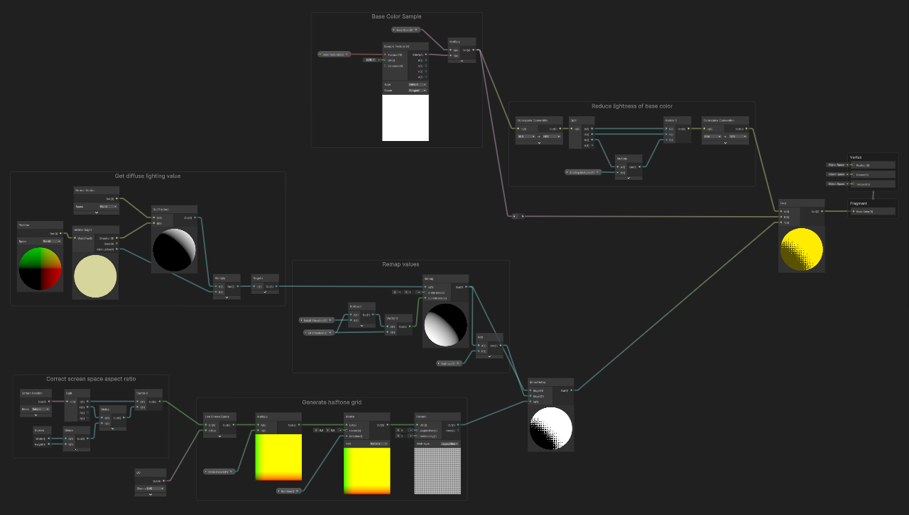

# HW 4: *3D Stylization*

# Demo

## Part 1

[Outline_Lines.MP4](img/Outline_Lines.mp4)

[Halftone.MP4](img/Halftone.mp4)

[Outline_NoLines.MP4](img/Outline_NoLines.mp4)

You can change between those two shading methods.

The repo could be found here: [GenshinRenderer](https://github.com/WANG-Ruipeng/GenshinRenderer)

## Part 2

[SceneInGame.MP4](img/SceneInGame.mp4)

# Reference Art


*From Genshin Impact*

# Features

## Halftone

The original concept art incorporates halftone techniques, so I experimented with different halftone methods in two separate projects.

In one project, I applied halftone shading directly in the fragment shader for surface coloring (Part 2). In the other project, I implemented halftone as a post-processing effect (Part 2). Comparatively, the post-processing approach provided better results.

### Fragment Shader



For the fragment shader, I used the GetMainLight function provided in the original assignment to calculate the diffuse value of the object’s surface.


Then, I sampled the halftone texture using screen coordinates to achieve the halftone effect.


The result looks pretty good:


### Post Process


In the post-processing shader, I also used the Universal Render Pipeline (URP) shader graph. To create the external “flame” effect, I sampled a noise texture based on screen coordinates and applied UV displacement to achieve the desired distorted outline.


This method allowed me to simulate dynamic, fiery visuals that enhanced the overall impact of the character render.


This post processing can be turned on and off in the Universal Render Data in the game assets:


## Textured Shadow


The textured shadow implementation primarily adhered to the original guidelines provided in the assignment. Through this process, I observed that the use of textured shadows effectively delivered a strong visual representation of depth within the scene. 


This approach allowed the various elements to appear more grounded and realistic, enhancing the overall spatial perception for the viewer. The shadow contributed to a richer sense of dimensionality, making the scene's structure more comprehensible and visually engaging.

## Outline

There are two types of outlining present. One is from the base version of Genshin Impact, while the other is the green outline seen in the reference image, which resembles the new Natlan Nightsoul effect.

| Green outline and character outline | Character outline | No outline |
| ----------------------------------- | ----------------- | ---------- |
|  |  |  |

### Character Outline

This ‘ToonOutlinePass.hlsl’ shader achieves an anime outline effect by offsetting the vertex positions along their normals in the view space, creating an outline silhouette. The GetOutlinePosition function calculates this offset based on the vertex depth and a customizable width parameter, while the fragment shader assigns a color gradient to the outline based on a sampled light map.

```cpp
float4 GetOutlinePosition(VertexPositionInputs vertexInput, VertexNormalInputs normalInput, half4 vertexColor)
{
    float z = vertexInput.positionVS.z;
    float width = GetOutlineWidth(z) * vertexColor.a;

    half3 normalVS = TransformWorldToViewNormal(normalInput.normalWS);
    normalVS = SafeNormalize(half3(normalVS.xy, 0.0));

    float3 positionVS = vertexInput.positionVS;
    positionVS += 0.01 * _OutlineZOffset * SafeNormalize(positionVS);
    positionVS += width * normalVS;

    float4 positionCS = TransformWViewToHClip(positionVS);
    positionCS.xy += _ScreenOffset.zw * positionCS.w;

    return positionCS;
}
```

The result is a visually distinct edge that enhances the character's cartoon appearance. Note that we use a pre-baked smoothed vertex normal, for a better visual effect.

### Green Outline

The green outline is done by inverted hull method. The vertex shader shifts the vertex positions in the world space by adding a scaled normal vector to create the illusion of an expanded silhouette. This pass uses front face culling so that only the expanded back faces are rendered, producing an outline around the object. 

```cpp
Varyings vert(Attributes input)
{
    Varyings output;
    float3 normalWS = TransformObjectToWorldNormal(input.normalOS);
    float3 positionWS = TransformObjectToWorld(input.positionOS.xyz);
    positionWS += normalWS * _ExpandWidth;
    output.positionHCS = TransformWorldToHClip(positionWS);
    return output;
}
```

The fragment returns a constant color defined by `_ExpandColor`, which is togglable in the Unity Editor.

| Width = 0.015 | Width = 0.03 |
| ------------- | ------------ |
|  |  |

## Post Processing

The post process shader includes multiple shader passes that contribute to a rich post-process pipeline with effects like bloom, blurring, tone mapping, and color grading.

1. **Bloom Processing**: The shader first features prefiltering to isolate bright areas based on a threshold, followed by horizontal and vertical Gaussian blur passes to create a soft glow effect. Then, an up-sampling pass combines blurred textures using adjustable weights to create the final bloom effect.
2. **Color Grading**: This pass adjusts the image exposure, applies tone mapping for high dynamic range compression, and modifies contrast and saturation to enhance the overall image quality.
3. **Blur Implementation**: The Gaussian blur function uses a 9-tap kernel to sample nearby texels in horizontal and vertical direction, creating a smooth, directional blur.
4. **Tone mapping and Exposure**: A custom tone mapping function is used to map high-intensity colors to a displayable range, creating a more filmic look. The exposure control adjusts overall brightness.

| Without post process | With post process |
| -------------------- | ----------------- |
|  |  |

# Credit

[Unity Genshin Renderer](https://www.bilibili.com/video/BV1ec4111789)

[Halftone shader tutorial](https://www.youtube.com/watch?v=3iZrZrEWQuA)

Genshin Impact