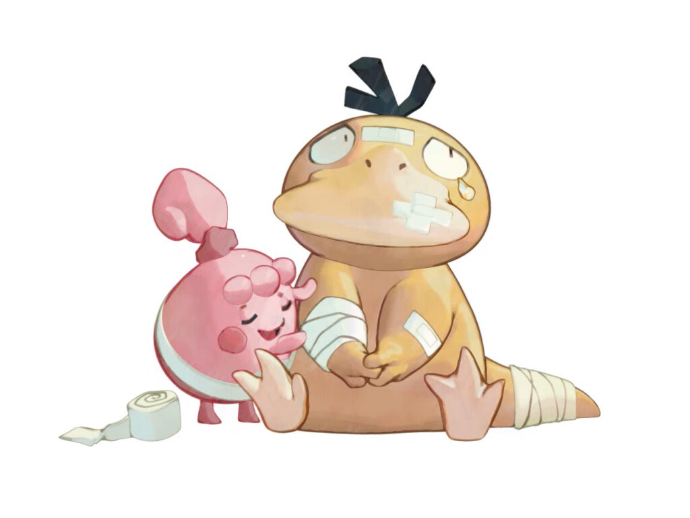

# HW 4: *3D Stylization*

## Project Overview:

The video has been uploaded with the name called hw4_record

---
# Tasks

## 0. Base Project Overview

## 1. Picking a Piece of Concept Art

I choose two pictures from [Emma Koch](https://www.artstation.com/ekoch) and hope to combine the styles from these two art pieces
 
 

---
## 2. Interesting Shaders

### To-Do:
1. **Improved Surface Shader**
   - Create a surface shader inspired by the surface(s) in my concept art. Use the three tone toon shader I created from the Stylization Lab as a starting point to build a more interesting shader that fulfills all of the following requirements:
      1. **Multiple Light Support**
      2. **Additional Lighting Feature**
      3. **Interesting Shadow**
      4. **Accurate Color Palette**
2. **Special Surface Shader**
   -  Followed [this tutorial](https://www.youtube.com/watch?v=VQxubpLxEqU&ab_channel=GabrielAguiarProd) to create vertex animation and appied it to my surface shader.
      

## 3. Outlines
fixed bugs and followed  [Tutorial on Depth Buffer Sobel Edge Detection Outlines in Unity URP](https://youtu.be/RMt6DcaMxcE?si=WI7H5zyECoaqBsqF) to create outlines and resemble crayon sketching

## 4. Full Screen Post Process Effect
create a full screen shader to change the color of my renders

---
## 5. Create a Scene
Imported a duck model and add some bubbles

## 6. Interactivity
using space to change the color and key "A" and key "D" to change the position of the light