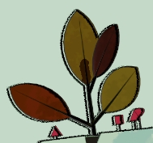

# HW 4: *3D Stylization*

## Project Overview:
In this assignment, I use a 2D concept art piece as inspiration to create a 3D Stylized scene in Unity. This gives me the opportunity to explore stylized graphics techniques alongside non-photo-realistic (NPR) real-time rendering workflows in Unity.

 
  
 

---

## 1. Picking a Piece of Concept Art

GRIS is one of the most visually stunning games I’ve ever played. The first time I experienced it, its art style left a deep impression on me. Unlike other games that endlessly add visual elements, sometimes far beyond the visual limit, GRIS’s clean and vibrant aesthetic pulls us out of that unnecessary upward spiral. This is why I chose to recreate an image from GRIS as my Concept Art.

 
 

**Credits from [itbeets](https://www.reddit.com/r/gris/comments/kifleu/just_played_this_game_last_week_and_fell_in_love/?rdt=59718) and In-game Screen Shot**

---
## 2. Interesting Shaders

In this section, I first improved the Surface Shader to support multiple light sources and used [this tutorial](https://www.youtube.com/watch?v=jcMRaFF9RRI) to add a RIM light on the backlit areas of objects.

 |  |
|:--:|
| *RIM Light* |

Next, I created a custom shadow material based on object UV, with a tiling scaler to control the sampling density. I developed several shadow materials to suit different visual effects.

|  |
|:--:|
| *Custom Shadow Texture* |

Finally, I created an animated color effect for the leaves on the character's head. I predefined four basic color schemes, and by using a custom function, Floor, and several toolbox functions, the hues shift between different tones over time, resulting in a dynamic color effect.

 |  |  | | |
|:--:|:--:|:--:|:--:|
| *Color1* | *Color2* |*Color3* |*Color4* |

## 3. Outlines
In this section, I used Unity’s powerful Render Feature functionality to add outline effects to the image via a full-screen post-processing pass. By learning to use depth and normal textures in the post-processing pass, I successfully applied a Sobel algorithm to add outlines to objects in the scene. To enhance the visual appeal, I added noise to create a time-based offset, giving the edges a slight offset and a hand-drawn look.
|  |
|:--:|
| *Outlines* |

## 4. Full Screen Post Process Effect
I added an additional full-screen post-process pass to apply an ACES tone mapping effect to the entire scene. The process mainly involves capturing the previous colors with MainTex, and then using a custom function in ShaderGraph to adjust the RGB channels for tone mapping at each pixel. As a result, the image became much clearer and brighter, which was exactly the intended effect!

|  |
|:--:|
| *Outlines* |

## 5. Creating a Scene

Inspired by the concept image, I assembled the final scene. Thanks to the artist for providing model resources, including the butterfly and our protagonist, the Forest Friend!
|  |
|:--:|
| *ACES Tone Mapping* |

## 6. Interactivity

In this section, I defined three visual modes for the scene, triggered by spacebar input through a Unity script. Pressing the spacebar cycles through these visual modes:

- Adjust Camera Speed - Implemented through a custom script on the Main Camera.
- Change the scene-wide material - Three predefined theme colors (green, red, yellow) are used, and pressing the spacebar cycles through them.
- Randomly changing colors for the butterflies - Each time a visual mode is switched, each butterfly randomly changes its color.

 |  |  | |
|:--:|:--:|:--:|
| *Mode1* | *Mode2* |*Mode3* |

## Resources:

- [RIM](https://www.youtube.com/watch?v=jcMRaFF9RRI)
- [Model](https://sketchfab.com/3d-models/gris-forest-friend-8378306886034f2fa590978d8d2506dc0)
- [Model-Butterflies](https://sketchfab.com/3d-models/butterflies-poster-2-444a930949e44c3abaa085fbb5a63e0c)