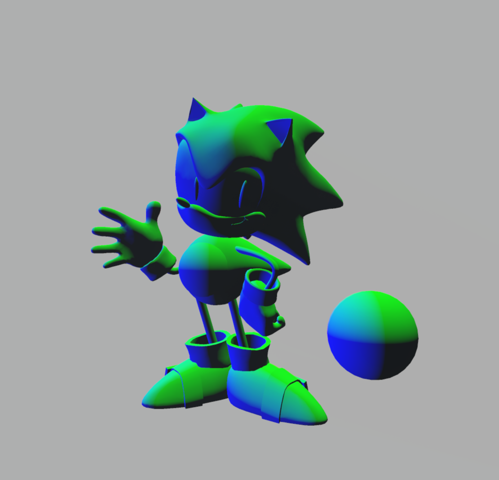

# HW 4: _Ghibli Stylization_

|  |
| -------------------------- |
| Result                     |

## Project Overview:

In this project, I implemented

1. A Ghibli-style shader that creates a oil or water painting feel texture.
2. A grass shader that generate animate-style grass using tessellation shader and geometry shader.
3. Post-process distance fog and volumetric light.
4. All materials receive multiple lights and cast shadows properly .

## Concept Art

For reference I picked a few shots from My Neighbor Totoro and Kiki's Delivery Service, along with an unrelated but beautiful animestyle dusk scene.

|  |  |  |  |
| ------------------------------- | ------------------------------- | ------------------------------- | ------------------------------- |
| Kiki (Studio Ghibli)            | Totoro (Studio Ghibli)          | Kiki (Studio Ghibli)            | Dusk Scnene (Unknown Author)    |

---

## Shaders

|  |
| ----------------------------------------------------------------- |
| Kiki (Studio Ghibli)                                              |

Since **Studio Ghibli** uses lots of water paiting techniques which is often built up in thin, transparent layers and has soft edges between colors. The first surface shader is primarily focusing on the replication of the water painting style.

The main idea is to distort and blend object's normal.

### Surface Shader1

---

|              |
| ------------------------------------------------------------------------------------ |
| [Paint Shader](Assets/Shaders/paint.shader) (For detailed shaderLab code check here) |

### Distort Normal

First we **discretize** an object's normal using **worley noise**

|  |  |
| ----------------------------------------------------------------------------- | ------------------------------------------------------------------------- |
| World Normal                                                                  | Worley Normal                                                             |

**Notice**: all normal operation is done with **object space normal** or **normalized object space position**, and transformed from object space to world space in the final step.
This is because we want the material behavior to be **consistant** when the model is rotated.

Next we will try to create a **soft transition** between normals.
By adding fbm noise to the oringinal normal, and apply the distorted normal with worley noise, we get the following result

|  |  |
| --------------------------------------------------------------------- | --------------------------------------------------------------------------- |
| Fbm Normal                                                            | FbmWorley Normal                                                            |

It's... a bit too noisy! But we can soften it up by applying a **generic brush texture**.
Here I created two cube maps for brush texture sampling using Photoshop, we'll sample them by object's **normalized object space position** instead of object space normal

|  |  |
| ------------------------------------------------------------------------------ | ------------------------------------------------------------------------------- |
| Brush CubeMap1                                                                 | Brush CubeMap2                                                                  |

I used an **overlay blendmode** to blend these two texture to create a compounded brush texture, then **lerp between the brushNormal and fbmNormal**, we can have the following result.

|  |  |
| ----------------------------------------------------------------------------- | ----------------------------------------------------------------------------- |
| Brush normal                                                                  | Final normal                                                                  |

Then we will use this newly generated normal to do all the shading work.

|  |
| ------------------------------------------------------------------------- |
| [Shade with Ramp Texture](Assets/Textures/Ramps)                          |

The above result is obtained by sampling colors from different **ramp textures** using lambert term. I created a series of ramp texture for the sonic model.
To make this shader appliable to more types of objects, I added a shader feature that allows user to choose between **a ramp texture, a solid color, or a uv mapping**

|  |  |
| ---------------------------------------------------------------------------- | --------------------------------------------------------------------------- |
| Solid Color                                                                  | UV Mapping                                                                  |

Sadly, this is more like an **oil painting** style instead of water painting style. This could be solved by changing the brush normal texture.

|  |
| -------------------------------------------------- |
| Code Snippet                                       |

### Multiple Lights

---

`#include "Packages/com.unity.render-pipelines.universal/ShaderLibrary/Lighting.hlsl"` allows us to use series of functions related to lighting. We can use `GetMainLight(SHADOWCOORD)` to
get main light information, and `GetAdditionalLight(INDEX, WORLDPOSITION)` to get additional light information

|  |  |
| ------------------------------------------------------------------------- | ---------------------------------------------------------------------------- |
| [Shade with Ramp Texture](Assets/Textures/Ramps)                          | Multiple Lighting                                                            |

### Depth Based Rim Light (Outline?)

---

Creating **rim light** in stylized rendering is much like what we do in PBR. But in anime, the rim light is often **regular** in shape. For example

|  |  |  |
| ------------------------------------------- | ------------------------------------------- | ------------------------------------------- |
| Cyberpunk: Edgerunner                       | Violet Evergarden                           | Dandadan                                    |

So based on this observation, we can create a **rim light mask** that constraints the variation of fresnel lighting.

Steps:

1. Read current pixel **depth** from depth buffer using screen uv.
2. Transform world normal from world space to **view space**, **extract its x and y components** to decide which direction to apply offset
3. Apply an offset to current screen uv in the previously calculated direction, **sample the depth at the offseted uv**
4. Compute the **depth difference**.
5. Compare the depth difference to a given **threshold**.

|  |
| ---------------------------------------------------- |
| Code Snippet                                         |

And then we can have an rim light mask.

|  |
| ------------------------------------------------------------------------- |
| Rim Light Mask                                                            |

Next, we multiply this value to an simplified **schlick-fresnel value**: `(1 - HdotV)^5` to get an anime-look rim light.  
Also, remember to multiply the rim light result with `Light.shadowAttenuation`. Shadowed area will not produce rim light.

|  |
| -------------------------------------------------------------------------- |
| Rim Light Result                                                           |

**Combine everything** and we finally have the above mentioned final result:

|  |
| ------------------------------------------------------------------------ |
| [Paint Shader](Assets/Shaders/paint.shader)                              |

### Foliage

---

Foliage is created using Blender by **transfering normal** from an object with smooth surface to another object.  
Tutorial: [**How to Create Ghibli Trees in 3D - Blender Tutorial**](https://www.youtube.com/watch?v=DEgzuMmJtu8)  
In unity, just apply it with a **paint shader** and a generic **ramp texture** will suffice.

|  |
| ---------------------------------------------------------------- |
| Foliage                                                          |

### Grass Shader

---

**Main Feature**:

1. Distance based **tessellation**
2. Generate grass instance using **geometry shader**
3. Random position, orientation, rotation, width, height
4. Multiple light support

[**Grass Shader**](https://roystan.net/articles/grass-shader/).

Primarily followed this tutorial, made some change to be compatible with Unity URP pipeline.

|  |  |  |
| -------------------------------- | -------------------------------- | --------------------------------- |
| Warm Light                       | Cold Light                       | Multiple Lights                   |

### Skybox

---

**Main Feature**:

1. Some modification to the paint shader
2. **Day night cycle** based on main light direction
3. Stars
4. ~~Skybox flow map~~ (Implemented but result was not good. [Can check this GDC talk if interested](https://www.youtube.com/watch?v=o66p1QDH7aI&t=896s))

### Post Process

---

**Main Feature**:

1. Raymarch **volumetric light**
2. **Distance fog** using depth buffer
3. Unity built in **lens flare**

## Reference:

**Art Resources**:  
[**【中字】Blender 吉卜力风格教程合集**](https://www.bilibili.com/video/BV1hr4y1a7Up/?spm_id_from=333.337.search-card.all.click&vd_source=354457820404a24b71c449a00f7c3cb9)
[**EASIEST Way to Make Painterly Animations in Blender 3D (Procedural Shader)**](https://www.youtube.com/watch?v=UfSw6428bcc&t=299s)
[**All Blend Modes! Looking at the Shader Graph Blend Mode Filters ✔️ 2021.1 | Unity Game Dev Tutorial**](https://www.youtube.com/watch?v=d9NKqeNtobc)
[**How to Create Ghibli Trees in 3D - Blender Tutorial**](https://www.youtube.com/watch?v=DEgzuMmJtu8)

**Tech Resources**:  
[**Moving the Heavens: An Artistic and Technical Look at the Skies of The Last of Us**](https://www.youtube.com/watch?v=o66p1QDH7aI&t=896s)
[**Grass Shader**](https://roystan.net/articles/grass-shader/)
[**NPR 卡通渲染 - Rim Light 边缘光 | 深度边缘光**](https://zhuanlan.zhihu.com/p/476051447)
