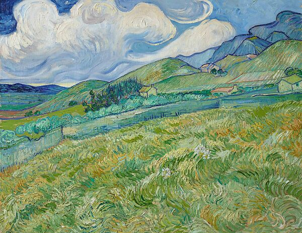

# HW 4: *3D Stylization* : Lewis Ghrist

## Reference Images / Style:

## Project:
For this project I was trying to mimic the swirling painterly effect of Van Gogh. To do this, I started with our base toon shader and added a series of noises to deform the UVs for another
noise. This distored the cutoff lines between the highlight, midtone, and shadow colors. On top of that I added some slight color variation using mor noise. In particular, a double worley noise
where the UVs are multiplied by one Worley and then passed into the second one. This give the circular swirling pattern I was going for. The colors and thresholds were all parameterized
for easy customization. To get the main brush stroke effect, I used a variation on the voronoi mozaic post process effect. By combinin it with some layers of noise (using the same technique
described above) I was able to rough up the edges of the voronoi cells.

For an added effect, I made a quick star mode shader using some time offset noise and gradient. This was applied to Mario and the trees so that a party-star mode was activaed on key press.

