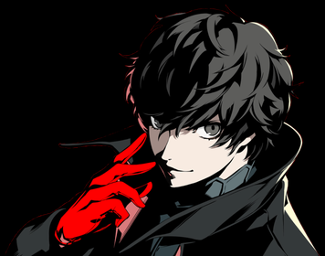
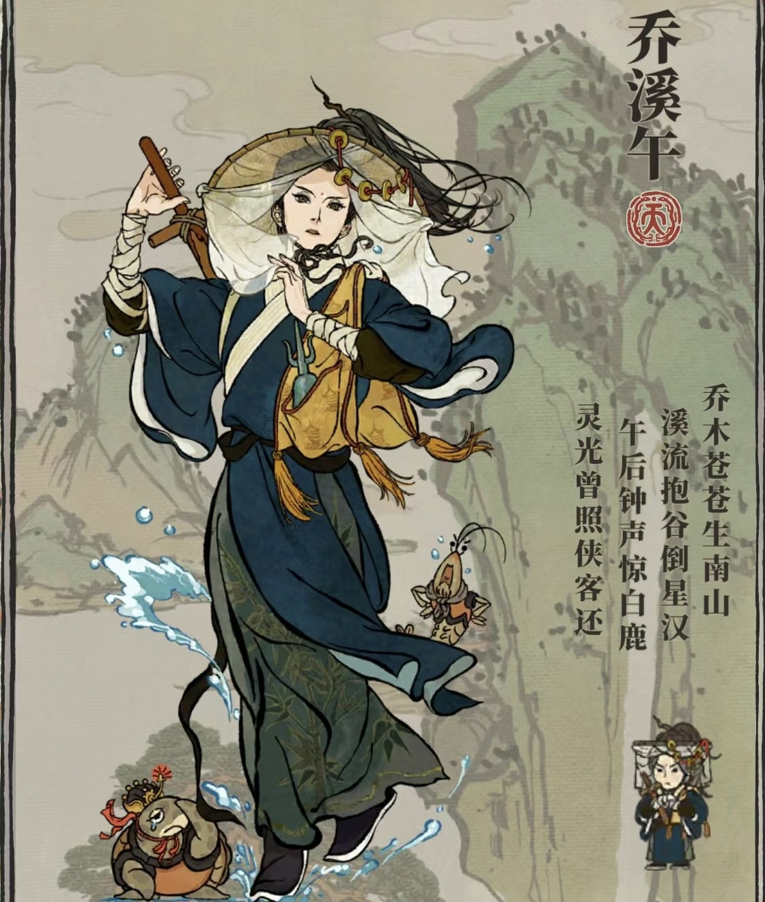

# *3D Stylization*

## Project Overview:
In this assignment, I use a 2D concept art piece as inspiration to create a 3D Stylized scene in Unity. This will give you the opportunity to explore stylized graphics techniques alongside non-photo-realistic (NPR) real-time rendering workflows in Unity.
|   |  |
|:--:|:--:|
| *2D Concept Illustration* | *3D Stylized Scene in Unity* |

## Result

[Video Link](https://youtu.be/2tjTbFXVLjI)

## Feature List:
1. Picking a Piece of Concept Art
2. Interesting Shaders
3. Outlines
4. Full Screen Post Process Effect
5. Creating a Scene
6. Interactivity
7. Extra Credit
---

## 1. Picking a Piece of Concept Art
For this project, I selected multiple references to guide different aspects of my 3D scene:
- Vibe and Atmosphere: I took inspiration from Reference 1 and Reference 2 to capture the desired mood and stylistic elements for the scene.
- Outline Style: I used Reference 3 as a basis for the outline technique to create a hand-drawn look.

|  |  |  |
|:--:|:--:|:--:|
| *[Persona](https://persona.atlus.com/p5r/?lang=en#)* | *[Kung Fu Panda](https://images.squarespace-cdn.com/content/v1/54fc8146e4b02a22841f4df7/1564599209054-DQVL0PMM8GG4Q8XYML52/Art+of+Kung+Fu+Panda+L+-+41.jpg)* | *[江南百景图](https://wiki.biligame.com/jiangnan/%E8%A7%92%E8%89%B2%E5%9B%BE%E9%89%B4)* |

## 2. Interesting Shaders
- **Multiple Light Support**
    - Implement multiple light supports
    - 
- **Additional Lighting Feature**
    - Rim Highlight: Added a rim highlight to create a glowing edge effect
    

- **Interesting Shadow**
    - Custom Shadow: Created a custom shadow texture to match the style of the scene. This shadow texture was designed to create a hand-drawn look.
    

- **Animated colors**
    - Added animation to the rim light colors

|  |  |
|:--:|:--:|
|Rim color red| Rim color blue|

## 3. Post Process Outlines
- Brush-like outlines: Developed a brush-like outline effect that mimics traditional drawing techniques
    

- Added noise to the outline thickness, giving each line a slightly different width.

|  |  |
|:--:|:--:|
|Thick | Thin |

## 4. Full Screen Post Process Effect
- Xuan Paper(Rice paper) texture: Applied a texture to the entire screen to make it look as if the scene is rendered on textured paper.

|  |  |
|:--:|:--:|
|Shadow Texture| Shadow |

## 5. Create a Scene
- The scene is created in the HW Scene 1.

[Video Link](https://youtu.be/2tjTbFXVLjI)

## 6. Interactivity
- Fanart mode 
    - Press Space to change materials of Sun and Ground

|  |  |
|:--:|:--:|
|Mode 1|Mode 2|

## 7. Extra Credit
- Moving Lights: Lights in the scene move subtly.
- Moving Sun: The sun shifts its position over time to simulate sunrise.
- Noise Shader: Incorporated a noise into shader for added texture effects for the sun.
---
## Resources:
1. Link to all reference videos:
    - [Playlist link](https://www.youtube.com/playlist?list=PLEScZZttnDck7Mm_mnlHmLMfR3Q83xIGp)
2. [Lab Video](https://youtu.be/jc5MLgzJong?si=JycYxROACJk8KpM4)
3. Very Helpful Creators/Videos from the internet
    - [Cyanilux](https://www.cyanilux.com/)
        - [Article on Depth in Unity | How depth buffers work!](https://www.cyanilux.com/tutorials/depth/) 
    - [NedMakesGames](https://www.youtube.com/@NedMakesGames)
        - [Toon Shader Lighting Tutorial](https://www.youtube.com/watch?v=GQyCPaThQnA&ab_channel=NedMakesGames)
        - [Tutorial on Depth Buffer Sobel Edge Detection Outlines in Unity URP](https://youtu.be/RMt6DcaMxcE?si=WI7H5zyECoaqBsqF)
    - [MinionsArt](https://www.youtube.com/@MinionsArt)
        - [Toon Shader Tutorial](https://www.youtube.com/watch?v=FIP6I1x6lMA&ab_channel=MinionsArt)
    - [Brackeys](https://www.youtube.com/@Brackeys)
        - [Intro to Unity Shader Graph](https://www.youtube.com/watch?v=Ar9eIn4z6XE&ab_channel=Brackeys)
    - [Robin Seibold](https://www.youtube.com/@RobinSeibold)
        - [Tutorial on Depth and Normal Buffer Robert's Cross Outliens in Unity](https://youtu.be/LMqio9NsqmM?si=zmtWxtdb1ViG2tFs)
    - [Alexander Ameye](https://ameye.dev/about/)
        - [Article on Edge Detection Post Process Outlines in Unity](https://ameye.dev/notes/edge-detection-outlines/)
4. Assets:
    - [Texture](https://www.88tph.com/sucai/12523489.html)
    - [Reference link](https://www.aplaybox.com/details/model/E1Kv8VWtqQ6d)
