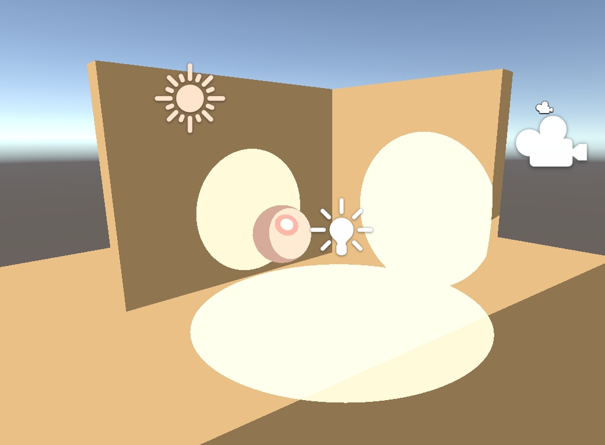

# HW 4: *3D Stylization*

## Final result

## 1. Pick a concept art
Model: [low poly anime character](https://www.cgtrader.com/free-3d-models/character/fantasy-character/japanese-kid-anime-style-lowpoly-animated)

| *Shader Style Reference* | *Character View* |
|:--:|:--:|
|   |  |

## 2. Shader
### Main features
- Multiple light support
  
- Specular highlight
  
- Shadow map
- Animated colors
- Animated shadows
  

## 3. Outlines
### Main features
- Post-process outlines based on depth and normal buffer
- Animated outlines

## 4. Full-screen post-process effect
### Main features
- Paper-like post-process effect

## 5. Interactivity
### Main features
- Party mode (press P to speed up!)

## Reference:
1. [Playlist link](https://www.youtube.com/playlist?list=PLEScZZttnDck7Mm_mnlHmLMfR3Q83xIGp)
2. [Lab Video](https://youtu.be/jc5MLgzJong?si=JycYxROACJk8KpM4)
3. Very Helpful Creators/Videos from the internet
    - [Cyanilux](https://www.cyanilux.com/)
        - [Article on Depth in Unity | How depth buffers work!](https://www.cyanilux.com/tutorials/depth/) 
    - [NedMakesGames](https://www.youtube.com/@NedMakesGames)
        - [Toon Shader Lighting Tutorial](https://www.youtube.com/watch?v=GQyCPaThQnA&ab_channel=NedMakesGames)
        - [Tutorial on Depth Buffer Sobel Edge Detection Outlines in Unity URP](https://youtu.be/RMt6DcaMxcE?si=WI7H5zyECoaqBsqF)
    - [MinionsArt](https://www.youtube.com/@MinionsArt)
        - [Toon Shader Tutorial](https://www.youtube.com/watch?v=FIP6I1x6lMA&ab_channel=MinionsArt)
    - [Brackeys](https://www.youtube.com/@Brackeys)
        - [Intro to Unity Shader Graph](https://www.youtube.com/watch?v=Ar9eIn4z6XE&ab_channel=Brackeys)
    - [Robin Seibold](https://www.youtube.com/@RobinSeibold)
        - [Tutorial on Depth and Normal Buffer Robert's Cross Outliens in Unity](https://youtu.be/LMqio9NsqmM?si=zmtWxtdb1ViG2tFs)
    - [Alexander Ameye](https://ameye.dev/about/)
        - [Article on Edge Detection Post Process Outlines in Unity](https://ameye.dev/notes/edge-detection-outlines/)
