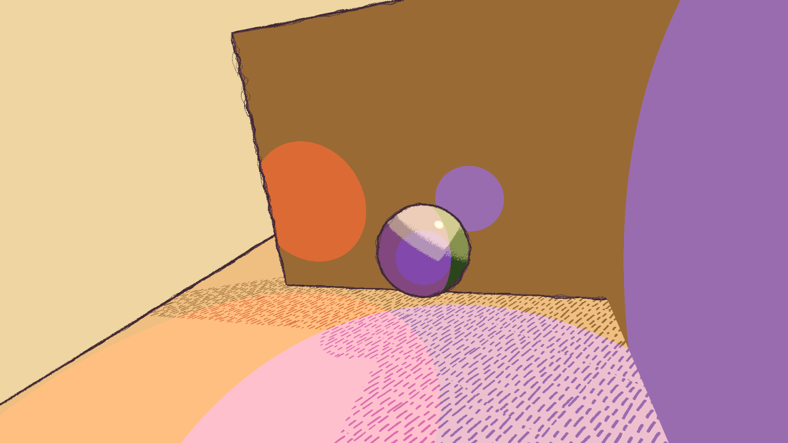

# HW 4: *3D Stylization*

## Turnaround Video

https://github.com/user-attachments/assets/f7d87188-47b1-488e-b665-2375ccd62515

Mike, Sully, and Roz

## Concept Art

My concept art inspiration comes from Monsters, Inc.

<image src="https://github.com/user-attachments/assets/763b17fb-7462-4a49-9f40-fe908b6c226d" width=500> ([source](https://characterdesignreferences.com/art-of-animation-6/art-of-monsters-inc))

<image src="https://github.com/user-attachments/assets/a2805625-e429-4a28-9589-db6c7c9e7fc6" width=500> ([source](https://www.etsy.com/listing/1336980625/monsters-inc-boos-drawings-of-sully-mike))

I wanted to capture the roughness of the outlines in the first image, while also emulating the handdrawn aesthetic of a child's scribbles.

## Project Description

### Improved surface shader

I implemented multiple light support, as well as a toon specular highlight and hatched shadow texture:

### Special surface shader

For the special shader, I implemented a rim highlight, along with an animated rim that uses cosine color palette, gradient noise, and a smoothstepped blending function.
Note how the rim changes colors in a staggered manner to achieve a handdrawn aesthetic:

https://github.com/user-attachments/assets/2af8a444-4d7a-40b1-b960-dfc28ca6c96f

### Outlines

I used an implementation of Roberts cross edge detection across normal, depth, and color to draw the outlines in a postprocess shader.
My outlines are animated in a staggered manner to have both adjustable scratchiness / noise and warping that are modified by gradient noise.
The final scene is achieves the handdrawn aesthetic by layering multiple outline materials with varying thicknesses, colors, noise scales, and warp factors.

### Postprocess Effect

I implemented a vignette shader with a gradient noise pattern.
This gives the edges of the scene a rough and handdrawn texture.

### Interactivity

Pressing the spacebar activates a "party mode", which swaps to special surface shaders on each character as well as toggles the turnaround camera.

## References

- [3D object models](https://sketchfab.com/3d-models/mike-sully-and-roz-599ddd73a8b645ada7d1d6920cedb29a)
- [Outline tutorial](https://www.youtube.com/watch?v=RMt6DcaMxcE) and [code](https://ameye.dev/notes/edge-detection-outlines/)
- [Toon shader lighting tutorial](https://www.youtube.com/watch?v=RC91uxRTId8)
- [Vignette shader tutorial](https://www.youtube.com/watch?v=xj_LLsJKO8E)
