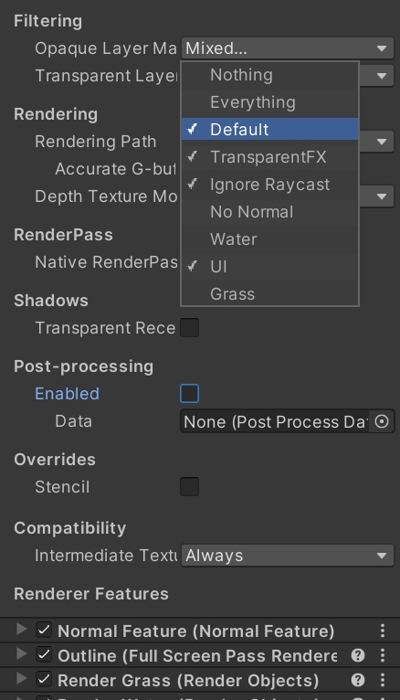

# HW 4: *3D Stylization*

## Magic Ruin

The magic ruin is a pixel style rendering inspired by some old 2D games.

[Youtube](https://www.youtube.com/watch?v=xSFgx2XWlxA)

## Reference Art

## Features

To replicate the referenced art style, I extract the following features:

- 3-level toon shading
- Waving trees and grass
- Moving cloud shadow
- Stone outline
- Pixelize postprocessing

Also, to fit the assignment requirements, I also added following features:

- Multiple light shading
- Interactive season change
- Reflection
- Texture support
- Vignette

### Toon Shading

Instead of using two thresholds to control the surface illuminance, I found that the gradient data is more suitable for light gradient control. Artists can even change the color of each gradient and add arbitrary number of levels.

### Waving Trees and Grass

The waving effect is achieved by modifying the vertex positions in the vertex shader. I used gradient noise as the angle to shift the vertex position. This gives nice and random waving effect to both leaf and grass.

### Moving Cloud Shading

Moving cloud shadow is also achieved by gradient noise. I use the xy coordinate of the grass as the input to sample from the noise function. Lower value would become the shadow of the sky.

### Stone Outline

The outline is calculated by sampling the normal and depth map and accumulating their difference. When the difference is above certain threshold, the outline would be drawn.

However, outline for grass and leaf is undesirable since their geometry is quite intense and therefore, their outline would be super fractious and make the image super dirty. Therefore, I need to remove grass and leaf from the outline shader. It is not enough to just filter out grass objects from the normal fetching pass since depth is still write to the buffer and stones' outline would be drawn over grass and leaf since outline is a postprocessing shader.

The solution is excluding objects tagged as **Grass** from the default pipeline so that they will not be in depth and normal buffer. Then, when everything is rendered, I added a new render pass to render these Grass objects. This ensures that grass and leaf can occlude outlines behind them.

### Pixelization

The idea of pixelization is very straight forward: just map the uv to a downsampled screen space and use floor function to downsample the previous frame buffer.

### Multiple Light Support

My toon shaders also support multiple lights. You can see that the grass, leaf and stones are also lit by the magic stone.

### Interactive Season Change

Press **Space** to change between spring, autumn and winter! (No summer XD)

### Interactive Pxielization

Press **P** to switch between different pixelization level!

### Reflection

The reflection I used is planar reflection. The idea is simple: place another camera in the scene and render the result to a new render target. Then, use this render target as the texture of the plane. To make the water surface more realistic, I also added some wave to the surface.

### Others

Texture mapping and vignette are also added to the scene to make the result more interesting.

Also, the directional light will change over time.

### Lab 5 Results

